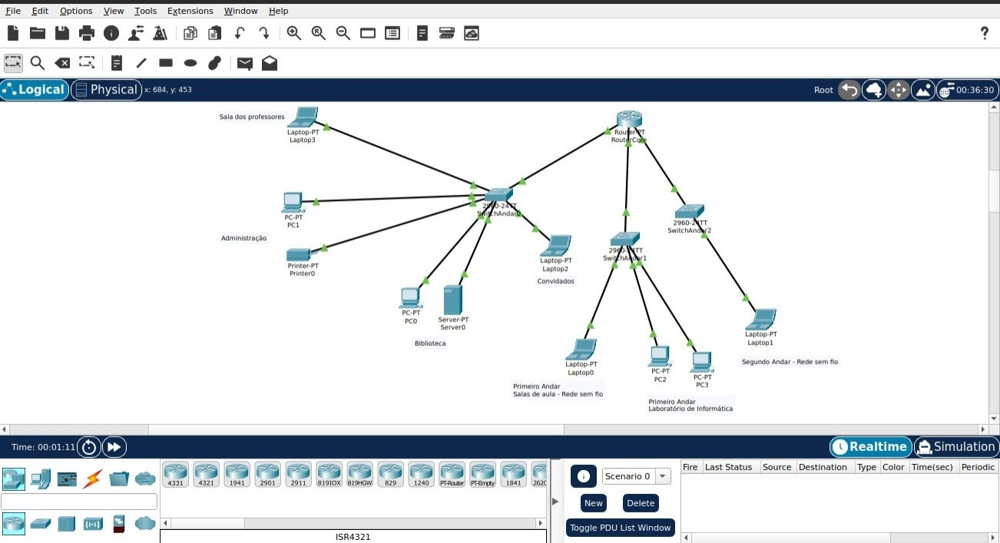

Projeto de Modernização da Infraestrutura de Rede Escolar

Integrantes

Lucas de Lima da Silva

Luiz Augusto Oliveira de Farias

Luiz Sergio Pompeu Alves Filho

David Ferreira

Resumo Executivo

Este projeto visa modernizar a infraestrutura de rede de uma escola, proporcionando uma conexão Wi-Fi eficiente e segura em todas as suas dependências. O térreo abrigará a sala dos professores, biblioteca e sala de coordenação, enquanto os andares superiores contarão com salas de aula conectadas. Uma rede separada para visitantes será implementada para reforçar a segurança da rede principal.

Benefícios

Melhoria na qualidade do ensino com acesso rápido e confiável à internet.

Aumento da produtividade de professores e funcionários.

Maior atratividade da escola para alunos e pais.

Conformidade com regulações de proteção de dados.

Clientes e Mercado

O principal cliente é a própria escola, representada pelos administradores e corpo docente. O projeto tem como foco a educação primária e secundária da comunidade local. Fornecedores serão essenciais na provisão de equipamentos e consultoria em TI.

Vantagens Competitivas

Infraestrutura de rede moderna e segura.

Diferencial competitivo para atração de novos alunos.

Integração de tecnologia educacional.

Gestão mais eficiente e otimização de custos.

Objetivo do Projeto

Aprimorar a infraestrutura de rede da escola, garantindo:

Internet de alta velocidade para ensino e administração.

Segurança e segmentação de tráfego de rede.

Integração de tecnologias educacionais.

Critérios de sucesso incluem:

Cobertura Wi-Fi completa e ininterrupta.

Implementação segura de redes segregadas.

Operação estável sem interrupções ou brechas de segurança.

Escopo do Projeto

A rede será do tipo LAN, cobrindo todas as áreas da escola, incluindo secretaria e salas de aula. A expansão futura da infraestrutura não está incluída no escopo deste projeto inicial, mas a implementação permitirá futuras expansões.

Para mais informações, consulte o documento PDF de planejamento.

Usanmos o Packet Tracer para desenvolver o projeto lógico.

Projeto lógico resultante:

